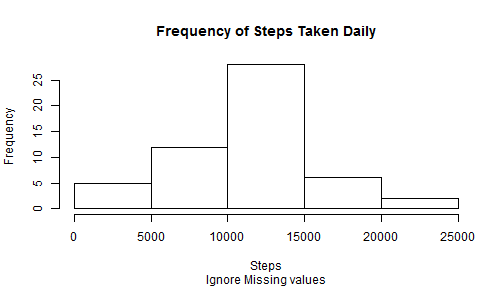

# Reproducible Research: Peer Assessment 1
## Introduction

It is now possible to collect a large amount of data about personal movement using activity monitoring devices such as a Fitbit, Nike Fuelband, or Jawbone Up. These type of devices are part of the "quantified self" movement - a group of enthusiasts who take measurements about themselves regularly to improve their health, to find patterns in their behavior, or because they are tech geeks. But these data remain under-utilized both because the raw data are hard to obtain and there is a lack of statistical methods and software for processing and interpreting the data.

This assignment makes use of data from a personal activity monitoring device. This device collects data at 5 minute intervals through out the day. The data consists of two months of data from an anonymous individual collected during the months of October and November, 2012 and include the number of steps taken in 5 minute intervals each day.
## Data
The data for this assignment can be downloaded from web site:

*   Dataset: [Activity monitoring data, 52K](https://d396qusza40orc.cloudfront.net/repdata%2Fdata%2Factivity.zip)

The variables included in this dataset are:

*   steps: Number of steps taking in a 5-minute interval (missing values are coded as NA)
*   date: The date on which the measurement was taken in YYYY-MM-DD format
*   interval: Identifier for the 5-minute interval in which measurement was taken

The dataset is stored in a comma-separated-value (CSV) file and there are a total of 17,568 observations in this dataset.
## Loading and preprocessing the data
This assignment requires the floowing libraries

```r
library("lattice");
library("xtable");
library("sqldf");
```

```
## Loading required package: gsubfn
## Loading required package: proto
## Loading required package: RSQLite
## Loading required package: DBI
## Loading required package: RSQLite.extfuns
```
Load dataset into a data frame.

```r
df <- read.csv("activity.csv",sep=",");
```
## What is mean total number of steps taken per day?
Use a SQL query statement to group records by date and count the number of steps each day. Records with missing values for "steps" are ignored. 

```r
sql <- "SELECT SUM(steps) AS stepCnt,date,interval FROM df WHERE steps <> 'NA' GROUP BY date";
df.Daily <- sqldf(sql);
```

```
## Loading required package: tcltk
```
The next plot is a histogram of the total number of steps taken daily.

```r
with(df.Daily,
     hist(stepCnt,
          main = 'Frequency of Steps Taken Daily',
          sub  = 'Ignore Missing values',
          xlab = 'Steps')
);
```


An average of 10766.189 steps are taken daily. The median value of steps taken daily is 10765.

```r
summary(df.Daily);
```

```
##     stepCnt              date       interval   
##  Min.   :   41   2012-10-02: 1   Min.   :2355  
##  1st Qu.: 8841   2012-10-03: 1   1st Qu.:2355  
##  Median :10765   2012-10-04: 1   Median :2355  
##  Mean   :10766   2012-10-05: 1   Mean   :2355  
##  3rd Qu.:13294   2012-10-06: 1   3rd Qu.:2355  
##  Max.   :21194   2012-10-07: 1   Max.   :2355  
##                  (Other)   :47
```
## What is the average daily activity pattern?
Use a SQL query statement to select complete records. Make a time series plot of the 5-minute interval and the average number of steps taken, averaged across all days. 

```r
sql <- "SELECT AVG(steps) AS stepAvg,date,interval FROM df WHERE steps <> 'NA' GROUP BY interval";
df.ts <- sqldf(sql);
df.ts$dateTime <- strptime(
    sprintf("%s %02d:%02d:%02d", 
            df.ts$date, 
            (df.ts$interval-df.ts$interval%%100)/100, 
            df.ts$interval%%100, 
            0),
    format = "%Y-%m-%d %T", 
    tz     = ""
); 
with( df.ts,
    {
      plot(interval,stepAvg,
         type = 'l',
         main = 'Average Daily Activity Pattern',
         ylab = 'Average Steps')
      grid()        
    }
);
```


The 5-minute interval with maximum average activity is labeled 835. It had an average of 206.170 steps.
## Imputing missing values
The dataset contains 2304 missing values.  In the dataset, missing values are represented by 'NA's.

```r
summary(df);
```

```
##      steps               date          interval   
##  Min.   :  0.0   2012-10-01:  288   Min.   :   0  
##  1st Qu.:  0.0   2012-10-02:  288   1st Qu.: 589  
##  Median :  0.0   2012-10-03:  288   Median :1178  
##  Mean   : 37.4   2012-10-04:  288   Mean   :1178  
##  3rd Qu.: 12.0   2012-10-05:  288   3rd Qu.:1766  
##  Max.   :806.0   2012-10-06:  288   Max.   :2355  
##  NA's   :2304    (Other)   :15840
```
The strategy for filling in all of the missing values in the dataset is to use the rounded mean for that 5-minute interval.

```r
df2  <- sqldf("SELECT AVG(steps) AS stepAvg,date,interval FROM df WHERE steps <> 'NA' GROUP BY interval");
NoNA <- sqldf("SELECT ROUND(CASE WHEN df.steps IS NULL THEN df2.stepAvg ELSE df.steps END,0) AS steps,df2.stepAvg,df.date,df.interval FROM df JOIN df2 ON df.interval=df2.interval")
df.NoNA <- data.frame(
    steps    = ifelse(is.na(NoNA$steps),NoNA$stepAvg,NoNA$steps),
    date     = strptime(sprintf("%s %02d:%02d:%02d", NoNA$date, (NoNA$interval-NoNA$interval%%100)/100, NoNA$interval%%100, 0),format="%Y-%m-%d %T", tz=""),
    interval = NoNA$interval
);
summary(df.NoNA);
```

```
##      steps            date                        interval   
##  Min.   :  0.0   Min.   :2012-10-01 00:00:00   Min.   :   0  
##  1st Qu.:  0.0   1st Qu.:2012-10-16 05:58:45   1st Qu.: 589  
##  Median :  0.0   Median :2012-10-31 11:57:30   Median :1178  
##  Mean   : 37.4   Mean   :2012-10-31 12:23:59   Mean   :1178  
##  3rd Qu.: 27.0   3rd Qu.:2012-11-15 17:56:15   3rd Qu.:1766  
##  Max.   :806.0   Max.   :2012-11-30 23:55:00   Max.   :2355
```
Replacing the missing values slightly alters the frequency distribution.

```r
df.NoNA.DailyStepCnt <- sqldf("SELECT SUM(steps) AS stepCnt,date FROM NoNA GROUP BY date");
with(df.NoNA.DailyStepCnt,
     hist(stepCnt,
          main = 'Frequency of Steps Taken Daily',
          sub  = 'Missing values were imputed',
          xlab = 'Steps')
);
```


## Are there differences in activity patterns between weekdays and weekends?
Identify if an observation occurs on a weekday or weekend. Add this identifier as a new variable to the dataset.

```r
df.NoNA$dayOfWeek <- factor( 
    ifelse( 
        weekdays(df.NoNA$date)=="Saturday" | weekdays(df.NoNA$date)=="Sunday",
        "weekend",
        "weekday"
    )
);
summary(df.NoNA);
```

```
##      steps            date                        interval   
##  Min.   :  0.0   Min.   :2012-10-01 00:00:00   Min.   :   0  
##  1st Qu.:  0.0   1st Qu.:2012-10-16 05:58:45   1st Qu.: 589  
##  Median :  0.0   Median :2012-10-31 11:57:30   Median :1178  
##  Mean   : 37.4   Mean   :2012-10-31 12:23:59   Mean   :1178  
##  3rd Qu.: 27.0   3rd Qu.:2012-11-15 17:56:15   3rd Qu.:1766  
##  Max.   :806.0   Max.   :2012-11-30 23:55:00   Max.   :2355  
##    dayOfWeek    
##  weekday:12960  
##  weekend: 4608  
##                 
##                 
##                 
## 
```
Calculate the average number of steps taken per interval, averaged across all weekdays or weekend days.

```r
df.weekend <- NULL;
df.weekday <- NULL;
for( i in 0:288 ) {
    n = i * 5;
    tmp <- subset(df.NoNA,dayOfWeek=='weekend'&interval==n);
    if( dim(tmp)[1] ) {
        irow <- data.frame(
            interval  = n, 
            avgSteps  = mean(tmp$steps), 
            dayOfWeek = 'weekend'
        );
        df.weekend <- rbind( df.weekend, irow );
    }
    tmp <- subset(df.NoNA,dayOfWeek=='weekday'&interval==n);
    if( dim(tmp)[1] ) {
        irow <- data.frame(
            interval  = n, 
            avgSteps  = mean(tmp$steps), 
            dayOfWeek = 'weekday'
        );
        df.weekday <- rbind( df.weekday, irow );
    }
}
summary(df.weekday$avgSteps);
```

```
##    Min. 1st Qu.  Median    Mean 3rd Qu.    Max. 
##    0.00    0.87   25.10   37.60   54.80  230.00
```

```r
summary(df.weekend$avgSteps);
```

```
##    Min. 1st Qu.  Median    Mean 3rd Qu.    Max. 
##    0.00    0.44   22.80   37.70   66.30  167.00
```
There is a slight difference in the peak average activity on a weekday versus a weekend. On average, slightly more activity occurs on a weekday. The plot below shows the activity comparison between weekdays and weekends:

```r
xyplot(
    avgSteps ~ interval | dayOfWeek, 
    data   = rbind(df.weekday,df.weekend), 
    type   = "l", 
    grid   = TRUE,
    main   = "Compare: Weekday Vs. Weekend",
    ylab   = "Average Steps Taken", 
    layout = c(1,2,1)
);
```


